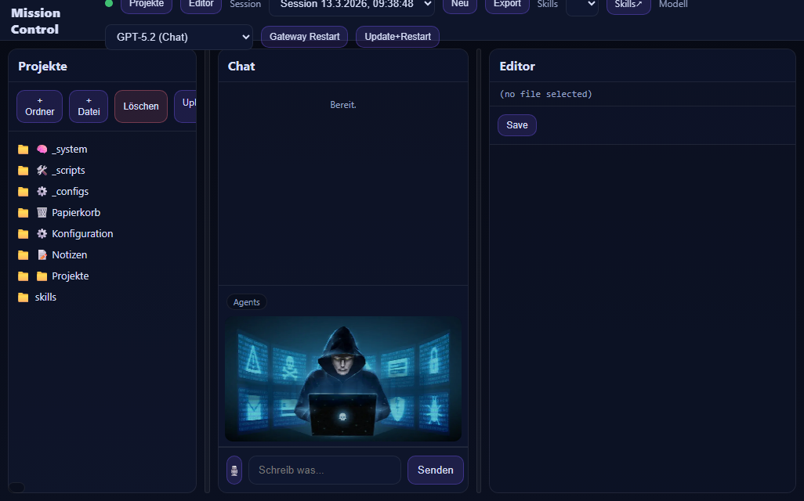

# Mission Control Dashboard (OpenClaw Skill)

Publish‑safe template of a Mission Control dashboard for OpenClaw.

- Safe defaults: binds to `127.0.0.1`
- No hardcoded tokens
- Includes UI + server template + install/start scripts

## What’s included

- `SKILL.md` – skill metadata + safety notes
- `references/USAGE.md` – user guide
- `assets/public/` – the web UI
- `assets/server.template.js` – server template (safe defaults)
- `assets/screenshots/mission-control.png` – screenshot
- `scripts/install.ps1`, `scripts/start.ps1` – install/run scripts

## Quick start (Windows)

1) Install files:

```powershell
.\scripts\install.ps1 -TargetDir C:\mission-control
```

2) Start locally:

```powershell
.\scripts\start.ps1 -Dir C:\mission-control -Bind 127.0.0.1 -Port 3000
```

3) Open:

- http://127.0.0.1:3000

## Screenshot



## Release download

Go to **Releases** and download the `.skill` artifact.

## Notes

This repository contains a template. It is intentionally conservative:
- dangerous actions (gateway restart/update) are disabled by default
- chat proxy is not wired in the template by default

If you want the full power version, you can extend the server template.
